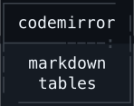

<h1 align="center">
  
</h1>

<h4 align="center"><a href="https://codemirror.net">CodeMirror</a> extension that turns <strong><a href="https://github.github.com/gfm/#tables-extension-">Markdown tables</a></strong> into <strong>interactive components</strong></h4>

<p align="center">
  <a href="https://ckant.com/codemirror-markdown-tables"><strong>View live demo</strong></a>
</p>

<p align="center">
  <a href="https://www.npmjs.com/package/codemirror-markdown-tables">
    
  </a>
  <a href="https://www.npmjs.com/package/codemirror-markdown-tables">
    
  </a>
  <a href="https://github.com/ckant/codemirror-markdown-tables/blob/main/LICENSE">
    
  </a>
</p>

<p align="center">
  <a href="#features">Features</a> •
  <a href="#installation">Installation</a> •
  <a href="#usage">Usage</a> •
  <a href="#customization">Customization</a> •
  <a href="#credits">Credits</a> •
  <a href="#license">License</a>
</p>

<div align="center"></div>

## Features

### Table editor

**A powerful table component that seamlessly integrates with CodeMirror**

- **Renders** Markdown table text as **interactive HTML tables**
- **Autoformats** and **prettifies** Markdown tables **while editing**
- **Renders** **custom styles** and **custom themes** in code and/or CSS
- **Renders** cells with **multi-line text**
- **Autocorrects line breaks** around tables **while editing** to keep them separate from surrounding text
- **Integrates** with native **[CodeMirror undo history](https://codemirror.net/docs/ref/#h_undo_history)**
- **Integrates** with native **[CodeMirror search](https://codemirror.net/docs/ref/#search)**
- **Implements** touch-friendly controls and editing for **mobile browsers**
- **Autoinserts line breaks** around **pasted tables** when necessary to keep them on their own lines
- **Autoescapes pipe characters** in cell text

#### Interactions

##### Type multi-line text

- **Create** line breaks with <kbd>Shift+Enter</kbd> (inserts a `<br>`)

##### Navigate around the table

- **Move around** the table with <kbd>Up</kbd>,<kbd>Down</kbd>,<kbd>Left</kbd>,<kbd>Right</kbd>
- **Move** to the **next cell** with <kbd>Tab</kbd>
  - **Append a new row** by moving past the last cell
- **Move** to the **previous cell** with <kbd>Shift+Tab</kbd>
  - **Prepend** a **new row** by moving before the first cell
- **Move** to the **cell below** with <kbd>Enter</kbd>
  - **Append** a **new row** by moving past the last row

##### Select cells

- **Select** a group of **cells** by <kbd>Clicking</kbd> and <kbd>Dragging</kbd>
  - **Scroll** the table by <kbd>Dragging</kbd> past the editor edge
- **Resize** the cell **selection** by <kbd>Shift+Clicking</kbd> and <kbd>Dragging</kbd>
- **Resize** the cell **selection** with <kbd>Shift+Up</kbd>,<kbd>Shift+Down</kbd>,<kbd>Shift+Left</kbd>,<kbd>Shift+Right</kbd>

##### Clear cells

- **Clear** selected cells with <kbd>Backspace</kbd>,<kbd>Delete</kbd>
- **Delete** selected **empty rows/columns** with <kbd>Backspace</kbd>,<kbd>Delete</kbd>

##### Copy/paste cells

- **Copy** selected cells **as a Markdown table** with <kbd>Ctrl+C</kbd>/<kbd>Cmd+C</kbd>
- **Cut** selected cells **as a Markdown table** with <kbd>Ctrl+X</kbd>/<kbd>Cmd+X</kbd>
- **Paste** a **Markdown table** into selected cells with <kbd>Ctrl+V</kbd>/<kbd>Cmd+V</kbd>
  - Select excess cells to **duplicate** the pasted Markdown table **across the extra cells**

##### Rearrange a row/column

- **Move row/column** by <kbd>Clicking Row/Column</kbd> and <kbd>Dragging</kbd> to a new location
  - **Scroll** the table by <kbd>Dragging</kbd> past the editor edge

##### Insert rows/columns

- **Insert** a **row** by <kbd>Clicking Row Border</kbd>
- **Insert** one or more **rows** by <kbd>Clicking Row Border</kbd> and <kbd>Dragging Down</kbd>
- **Insert** a **column** by <kbd>Clicking Column Border</kbd>
- **Insert** one or more **columns** by <kbd>Clicking Column Border</kbd> and <kbd>Dragging Right</kbd>

##### Delete empty rows/columns

- **Delete** one or more **empty rows** by <kbd>Clicking Row Border</kbd> and <kbd>Dragging Up</kbd>
- **Delete** one or more **empty columns** by <kbd>Clicking Column Border</kbd> and <kbd>Dragging Left</kbd>

##### Append rows/columns

- **Append** a **row** by <kbd>Clicking Table Bottom Button</kbd>
- **Append** one or more **rows** by <kbd>Clicking Table Bottom Button</kbd> and <kbd>Dragging Down</kbd>
- **Append** a **column** by <kbd>Clicking Table Right Button</kbd>
- **Append** one or more **columns** by <kbd>Clicking Table Right Button</kbd> and <kbd>Dragging Right</kbd>
- **Append** a **row and column** by <kbd>Clicking Table Bottom-Right Button</kbd>
- **Append** one or more **rows and columns** by <kbd>Clicking Table Bottom-Right Button</kbd> and <kbd>Dragging Down-Right</kbd>

##### Trim empty rows/columns

- **Trim** one or more **empty rows** by <kbd>Clicking Table Bottom Button</kbd> and <kbd>Dragging Up</kbd>
- **Trim** one or more **empty columns** by <kbd>Clicking Table Right Button</kbd> and <kbd>Dragging Left</kbd>
- **Trim** one or more **empty rows and columns** by <kbd>Clicking Table Bottom-Right Button</kbd> and <kbd>Dragging Up-Left</kbd>

##### Execute actions on a row/column

- **Open row/column menu** by <kbd>Clicking Row/Column</kbd>
  - **Sort by column**
  - **Align a column** to left, center, or right
  - **Unalign a column**
  - **Add a row/column**
  - **Move a row/column**
  - **Duplicate a row/column**
  - **Clear a row/column**
  - **Delete a row/column**

### Autocompletion

**An convenient autocomplete menu for creating tables**

- Pops up a CodeMirror autocompletion menu after typing `|` on an empty line
- Displays a customizable list of table size options

### Command

**A command that smartly inserts a new Markdown table**

- Inserts an empty Markdown table at the cursor or replaces the current selection
- Adds line breaks around table when necessary to prevent overlap with surrounding text

## Installation

```shell
npm install codemirror-markdown-tables
```

## Usage

### Add the core extension (required)

```typescript
import { EditorView } from "@codemirror/view"

import { markdownTables } from "codemirror-markdown-tables"

// Add Markdown tables extension to CodeMirror
new EditorView({
  extensions: [markdownTables()],
})
```

### Add an extension that autocompletes a table after typing `|` (optional)

```typescript
import { autocompletion } from "@codemirror/autocomplete"
import { markdown, markdownLanguage } from "@codemirror/lang-markdown"
import { EditorView } from "@codemirror/view"

import { markdownTableAutocompleter } from "codemirror-markdown-tables"

// Create markdown language with GitHub-flavored Markdown support
const markdownLanguageSupport = markdown({ base: markdownLanguage })

// Create Markdown tables autocomplete extension (merges with other Markdown autocomplete extensions)
const markdownTableAutocompletion = markdownLanguageSupport.language.data.of({
  autocomplete: markdownTableAutocompleter(),
})

// Add all extensions to CodeMirror
new EditorView({
  extensions: [autocompletion(), markdownLanguageSupport, markdownTableAutocompletion],
})
```

### Add a keyboard shortcut that inserts a Markdown table (optional)

```typescript
import { EditorView, keymap } from "@codemirror/view"

import { insertEmptyMarkdownTable } from "codemirror-markdown-tables"

// Create key binding that inserts a 2x2 table
const insertTableKeyBinding = {
  key: "Alt-Mod-t",
  run: insertEmptyMarkdownTable(),
}

// Wrap the key binding inside a keymap and add the extension to CodeMirror
new EditorView({
  extensions: keymap.of([insertTableKeyBinding]),
})
```

## Customization

### Core config

Optional config passed into the `markdownTables()` function to customize the core extension

| Property            | Values                                                     | Default _(when omitted or undefined)_                | Description                                                                                                                                                                                                                                                                                                                                                                                                                                                                                                                                                                                                                                                                                                                                                                                                                                                                                                                                                                                                                                                                                                                                                                                                                                                                                                                                                                                                                                 |
| ------------------- | ---------------------------------------------------------- | ---------------------------------------------------- | ------------------------------------------------------------------------------------------------------------------------------------------------------------------------------------------------------------------------------------------------------------------------------------------------------------------------------------------------------------------------------------------------------------------------------------------------------------------------------------------------------------------------------------------------------------------------------------------------------------------------------------------------------------------------------------------------------------------------------------------------------------------------------------------------------------------------------------------------------------------------------------------------------------------------------------------------------------------------------------------------------------------------------------------------------------------------------------------------------------------------------------------------------------------------------------------------------------------------------------------------------------------------------------------------------------------------------------------------------------------------------------------------------------------------------------------- |
| `theme`             | `TableTheme`,<br>`{ light: TableTheme; dark: TableTheme }` | `{ light: TableTheme.light, dark: TableTheme.dark }` | Color scheme for the table<br><br>When set to a `light` and `dark` theme, the theme adjusts based on the **CodeMirror light and dark mode configuration** (_not_ CSS `prefers-color-scheme`)<br><br>When set to a _single_ theme, the theme applies in both modes (i.e. `theme: SomeTheme` is equivalent to `theme: { light: SomeTheme, dark: SomeTheme }`)                                                                                                                                                                                                                                                                                                                                                                                                                                                                                                                                                                                                                                                                                                                                                                                                                                                                                                                                                                                                                                                                                 |
| `style`             | `TableStyle`                                               | `TableStyle.default`                                 | Fonts and other styles for the table                                                                                                                                                                                                                                                                                                                                                                                                                                                                                                                                                                                                                                                                                                                                                                                                                                                                                                                                                                                                                                                                                                                                                                                                                                                                                                                                                                                                        |
| `selectionType`     | `"codemirror"`, `"native"`                                 | `"codemirror"`                                       | Text cursor and selection implementation for the table cell editor<br><br>When set to `"codemirror"`, the editor uses CodeMirror's implementation<br>Essentially, the CodeMirror editor _embedded inside cells_ enables the [`drawSelection`](https://codemirror.net/docs/ref/#view.drawSelection) extension along with some CSS that hides the browser's native cursor and selection<br><br>When set to `native`, the editor uses the browser's implementation<br><br>Specify `native` only if [`drawSelection`](https://codemirror.net/docs/ref/#view.drawSelection) isn't enabled in the _root_ CodeMirror editor (it's enabled by default with `basicSetup` and `minimalSetup`)                                                                                                                                                                                                                                                                                                                                                                                                                                                                                                                                                                                                                                                                                                                                                         |
| `handlePosition`    | `"outside"`, `"inside"`                                    | `"outside"`                                          | Position of the row and column header grips<br><br>When set to `"outside"`, handles appear beyond the top/left edge of the table<br>This requires a sufficient left margin to keep the table edge aligned with the _root_ CodeMirror editor edge, but it's much easier to click and drag the handles, especially on mobile<br><br>When set to `"inside"`, handles appear on the top/left table border itself<br>This requires no extra left margin, but it's difficult to click and drag the handles, especially on mobile                                                                                                                                                                                                                                                                                                                                                                                                                                                                                                                                                                                                                                                                                                                                                                                                                                                                                                                  |
| `lineWrapping`      | `"wrap"`", `"nowrap"`                                      | `"wrap"`                                             | Wrapping mode of the table<br><br>When set to `"wrap"`, wraps long table cell text<br>Essentially, the CodeMirror editor _embedded inside cells_ enables the [`lineWrapping`](https://codemirror.net/docs/ref/#view.EditorView^lineWrapping) extension along with the CSS `"word-break": "normal", "overflow-wrap": "break-word"`<br><br>When set to `"nowrap"`, the editor does _not_ wrap long table cell text<br>The editor sets the CSS to `white-space: "pre"`                                                                                                                                                                                                                                                                                                                                                                                                                                                                                                                                                                                                                                                                                                                                                                                                                                                                                                                                                                         |
| `extensions`        | `Extension[]`                                              | `[]`                                                 | Extensions for the table cell editor<br><br>The CodeMirror editor _embedded inside cells_ (not the _root_ CodeMirror editor) enables the given extensions<br><br>The table cell editor doesn't automatically inherit _root_ CodeMirror editor extensions<br>Instead, specify basic editor extensions like [`highlightWhitespace`](https://codemirror.net/docs/ref/#view.highlightWhitespace) here to enable them inside cells<br><br>Keyboard shortcuts specified here execute actions on the CodeMirror editor _embedded inside cells_, rather than the _root_ CodeMirror editor<br>They operate on the text _inside the cell_ in isolation, rather than the text of the document _as a whole_<br><br>Specify KeyBindings from [`defaultKeymap`](https://codemirror.net/docs/ref/#commands.defaultKeymap) or similar here to enable basic shortcuts inside the cell editor<br>[`defaultKeymap`](https://codemirror.net/docs/ref/#commands.defaultKeymap) defines shortcuts like <kbd>Ctrl+A</kbd>/<kbd>Ctrl+A</kbd> which should select all the _cell_ text rather than all the _document_ text<br><br>Conversely, specify KeyBindings from [`historyKeymap`](https://codemirror.net/docs/ref/#commands.historyKeymap) and [`searchKeymap`](https://codemirror.net/docs/ref/#search.searchKeymap) in **`globalKeyBindings`** instead, since these keyboard shortcuts operate on the _root_ CodeMirror editor and the document _as a whole_ |
| `markdownConfig`    | `MarkdownConfig`                                           | `{}`                                                 | Markdown language configuration for the table cell editor<br><br>The CodeMirror _editor embedded inside cells_ calls the [`markdown()` function in `@codemirror/lang-markdown`](https://github.com/codemirror/lang-markdown?tab=readme-ov-file#user-content-markdown) with the specified options<br><br>The table cell editor doesn't automatically inherit the _root_ CodeMirror Markdown language configuration<br><br>[See `@codemirror/lang-markdown` for descriptions](https://github.com/codemirror/lang-markdown?tab=readme-ov-file#user-content-markdown^config)                                                                                                                                                                                                                                                                                                                                                                                                                                                                                                                                                                                                                                                                                                                                                                                                                                                                    |
| `globalKeyBindings` | `KeyBinding[]`                                             | `[]`                                                 | Keyboard shortcuts for the table cell editor that delegate to the _root_ CodeMirror editor<br><br>Keyboard shortcuts specified here execute actions on the _root_ CodeMirror editor, rather than the CodeMirror editor _embedded inside cells_<br>They operate on the text of the document _as a whole_, rather than the text _inside the cell_ in isolation<br><br>Specify KeyBindings from [`historyKeymap`](https://codemirror.net/docs/ref/#commands.historyKeymap) or similar here to enable history shortcuts while inside the cell editor<br>[`historyKeymap`](https://codemirror.net/docs/ref/#commands.historyKeymap) defines keyboard shortcuts like <kbd>Ctrl+Z</kbd>/<kbd>Cmd+Z</kbd> which should undo across the _document_ text rather than just the _cell_ text<br>Another example is [`searchKeymap`](https://codemirror.net/docs/ref/#search.searchKeymap) which defines keyboard shortcuts that should search across the entire _document_ text rather than just the _cell_ text<br><br>Conversely, specify KeyBindings from [`defaultKeymap`](https://codemirror.net/docs/ref/#commands.defaultKeymap) in **`extensions`** instead, since these keyboard shortcuts operate on the CodeMirror editor _embedded inside cells_ and the text _inside the cell_ in isolation                                                                                                                                                 |

#### Table theme

A theme is a collection of properties that define the CSS color scheme

##### Built-in themes

| Name                                                    | Description                                                                                                  |
| ------------------------------------------------------- | ------------------------------------------------------------------------------------------------------------ |
| <code>TableTheme.<strong>light</strong></code>          | Basic light theme that works well with the CodeMirror default theme                                          |
| <code>TableTheme.<strong>dark</strong></code>           | Basic dark theme                                                                                             |
| <code>TableTheme.<strong>githubLight</strong></code>    | Theme based on table colors in GitHub's light theme                                                          |
| <code>TableTheme.<strong>githubDark</strong></code>     | Theme based on table colors in GitHub's dark theme                                                           |
| <code>TableTheme.<strong>githubSoftDark</strong></code> | Theme based on table colors in GitHub's soft dark theme                                                      |
| <code>TableTheme.<strong>oneDark</strong></code>        | Dark theme that works well with [`@codemirror/theme-one-dark`](https://github.com/codemirror/theme-one-dark) |

##### Custom themes

Create custom themes in code or override theme properties in CSS

##### In code

```typescript
import { TableTheme } from "codemirror-markdown-tables"

const customDarkTheme = TableTheme.dark.with({
  "--tbl-theme-header-row-background": "gray",
  "--tbl-theme-outline-color": "green",
})
```

##### In CSS

```css
:root {
  --tbl-theme-header-row-background: gray;
  --tbl-theme-outline-color: green;
}
```

##### Properties

Theme properties correspond directly to CSS variables of the same name defined in `:root` scope

| Property                                                           | Values      | Description                                                                                                                                                                                                                                                                                                                                                                                                   |
| ------------------------------------------------------------------ | ----------- | ------------------------------------------------------------------------------------------------------------------------------------------------------------------------------------------------------------------------------------------------------------------------------------------------------------------------------------------------------------------------------------------------------------- |
| <code>--tbl-theme-<strong>row-background</strong></code>           | CSS `color` | Background color of all cells, unless overriden by other `*-row-background` properties                                                                                                                                                                                                                                                                                                                        |
| <code>--tbl-theme-<strong>header-row-background</strong></code>    | CSS `color` | Background color of the cells in the header row                                                                                                                                                                                                                                                                                                                                                               |
| <code>--tbl-theme-<strong>even-row-background</strong></code>      | CSS `color` | Background color of the cells in even rows                                                                                                                                                                                                                                                                                                                                                                    |
| <code>--tbl-theme-<strong>odd-row-background</strong></code>       | CSS `color` | Background color of the cells in odd rows (except the header row)                                                                                                                                                                                                                                                                                                                                             |
| <code>--tbl-theme-<strong>border-color</strong></code>             | CSS `color` | Color of borders                                                                                                                                                                                                                                                                                                                                                                                              |
| <code>--tbl-theme-<strong>border-hover-color</strong></code>       | CSS `color` | Color of a hovered border                                                                                                                                                                                                                                                                                                                                                                                     |
| <code>--tbl-theme-<strong>border-active-color</strong></code>      | CSS `color` | Color of a clicked border                                                                                                                                                                                                                                                                                                                                                                                     |
| <code>--tbl-theme-<strong>outline-color</strong></code>            | CSS `color` | Color of the outline around selected cells                                                                                                                                                                                                                                                                                                                                                                    |
| <code>--tbl-theme-<strong>text-color</strong></code>               | CSS `color` | Color of text                                                                                                                                                                                                                                                                                                                                                                                                 |
| <code>--tbl-theme-<strong>menu-border-color</strong></code>        | CSS `color` | Color of menu borders                                                                                                                                                                                                                                                                                                                                                                                         |
| <code>--tbl-theme-<strong>menu-background</strong></code>          | CSS `color` | Background color of menu items                                                                                                                                                                                                                                                                                                                                                                                |
| <code>--tbl-theme-<strong>menu-hover-background</strong></code>    | CSS `color` | Background color of a hovered menu item                                                                                                                                                                                                                                                                                                                                                                       |
| <code>--tbl-theme-<strong>menu-text-color</strong></code>          | CSS `color` | Color of menu item text                                                                                                                                                                                                                                                                                                                                                                                       |
| <code>--tbl-theme-<strong>menu-hover-text-color</strong></code>    | CSS `color` | Color of hovered menu item text                                                                                                                                                                                                                                                                                                                                                                               |
| <code>--tbl-theme-<strong>select-all-focus-overlay</strong></code> | CSS `color` | Color of the layer overlaid on table when a <kbd>Select All</kbd> takes place and the editor has focus<br><br>The overlay shows as an alpha layer _above the table_ whereas CodeMirror places its default selection background _behind editor text_<br>So specify an alpha overlay color that, when mixed with the table background color, mimics the opaque CodeMirror selection background color            |
| <code>--tbl-theme-<strong>select-all-blur-overlay</strong></code>  | CSS `color` | Color of the layer overlaid on table when a <kbd>Select All</kbd> takes place and the editor _doesn't_ have focus<br><br>The overlay shows as an alpha layer _above the table_ whereas CodeMirror places its default selection background _behind editor text_<br>So specify an alpha overlay color that, when mixed with the table background color, mimics the opaque CodeMirror selection background color |

#### Table style

A style is a collection of properties that define fonts and other CSS styles

##### Built-in styles

| Name                                             | Values                                                                                                                                                                                                                  | Description                        |
| ------------------------------------------------ | ----------------------------------------------------------------------------------------------------------------------------------------------------------------------------------------------------------------------- | ---------------------------------- |
| <code>TableStyle.<strong>default</strong></code> | `{ "--tbl-style-font-family": "system-ui", "--tbl-style-font-size": "inherit", "--tbl-style-menu-font-family": "system-ui", "--tbl-style-menu-font-size": "inherit", "--tbl-style-default-header-alignment": "left", }` | Basic style with sensible defaults |

##### Custom styles

Create custom styles in code or override style properties in CSS

##### In code

```typescript
import { TableStyle } from "codemirror-markdown-tables"

const customStyle = TableStyle.default.with({
  "--tbl-style-font-family": '"Comic Sans", sans-serif',
  "--tbl-style-font-size": "16px",
})
```

##### In CSS

```css
:root {
  --tbl-style-font-family: "Comic Sans, sans-serif";
  --tbl-style-font-size: 16px;
}
```

##### Properties

Style properties correspond directly to CSS variables of the same name defined in `:root` scope

| Property                                                           | Values                          | Description                                                             |
| ------------------------------------------------------------------ | ------------------------------- | ----------------------------------------------------------------------- |
| <code>--tbl-style-<strong>font-family</strong></code>              | CSS `font-family`               | Font family of text                                                     |
| <code>--tbl-style-<strong>font-size</strong></code>                | CSS `font-size`                 | Font size of text                                                       |
| <code>--tbl-style-<strong>menu-font-family</strong></code>         | CSS `font-family`               | Font family of menu item text                                           |
| <code>--tbl-style-<strong>menu-font-size</strong></code>           | CSS `font-size`                 | Font size of menu item text                                             |
| <code>--tbl-style-<strong>default-header-alignment</strong></code> | `"left"`, `"center"`, `"right"` | Alignment of text in header cell when its column is otherwise unaligned |

### Table autocompleter config

Optional config passed into the `markdownTableAutocompleter()` function to customize the autocompleter

| Property  | Values                            | Default _(when omitted or undefined)_                                | Description                             |
| --------- | --------------------------------- | -------------------------------------------------------------------- | --------------------------------------- |
| `options` | `{ rows: number, cols: number}[]` | `[{ rows: 2, cols: 2 }, { rows: 3, cols: 3 }, { rows: 4, cols: 4 }]` | Options shown in the autocomplete popup |

### Insert table command config

Optional config passed into the `insertEmptyMarkdownTable()` function to customize the insert table command

| Property | Values                          | Default _(when omitted or undefined)_ | Description                |
| -------- | ------------------------------- | ------------------------------------- | -------------------------- |
| `size`   | `{ rows: number, cols: number}` | `{ rows: 2, cols: 2 }`                | Size of the inserted table |

## Examples

### Complete, minimal configuration

```typescript
import { basicSetup } from "codemirror"
import { markdown, markdownLanguage } from "@codemirror/lang-markdown"
import { EditorView, keymap } from "@codemirror/view"

import {
  insertEmptyMarkdownTable,
  markdownTables,
  markdownTableAutocompleter,
} from "codemirror-markdown-tables"

const markdownLanguageSupport = markdown({ base: markdownLanguage })

new EditorView({
  extensions: [
    basicSetup,
    markdownLanguageSupport,
    markdownLanguageSupport.language.data.of({ autocomplete: markdownTableAutocompleter() }),
    markdownTables(),
    keymap.of([{ key: "Alt-Mod-t", run: insertEmptyMarkdownTable({ rows: 2, cols: 2 }) }]),
  ],
  parent: document.body,
})
```

### Complete, extensive configuration

```typescript
import { basicSetup } from "codemirror"
import { defaultKeymap, historyKeymap } from "@codemirror/commands"
import { markdown, markdownLanguage } from "@codemirror/lang-markdown"
import { searchKeymap } from "@codemirror/search"
import { EditorView, highlightSpecialChars, keymap } from "@codemirror/view"
import { Autolink, Emoji, Strikethrough, Subscript, Superscript } from "@lezer/markdown"

import {
  insertEmptyMarkdownTable,
  markdownTables,
  markdownTableAutocompleter,
  TableStyle,
  TableTheme,
} from "codemirror-markdown-tables"

const markdownLanguageSupport = markdown({ base: markdownLanguage })

new EditorView({
  extensions: [
    basicSetup,
    markdownLanguageSupport,
    markdownLanguageSupport.language.data.of({
      autocomplete: markdownTableAutocompleter({
        options: [
          { rows: 2, cols: 2 },
          { rows: 3, cols: 3 },
        ],
      }),
    }),
    markdownTables({
      theme: {
        light: TableTheme.light,
        dark: TableTheme.dark.with({
          "--tbl-theme-row-background": "#000",
          "--tbl-theme-text-color": "#ccc",
          "--tbl-theme-menu-background": "#000",
          "--tbl-theme-menu-text-color": "#ccc",
        }),
      },
      style: TableStyle.default.with({
        "--tbl-style-font-size": "16px",
        "--tbl-style-menu-font-size": "14px",
        "--tbl-style-default-header-alignment": "center",
      }),
      markdownConfig: {
        extensions: [Strikethrough, Autolink, Subscript, Superscript, Emoji],
      },
      extensions: [highlightSpecialChars(), keymap.of(defaultKeymap)],
      globalKeyBindings: [...historyKeymap, ...searchKeymap],
    }),
    keymap.of([{ key: "Alt-Mod-t", run: insertEmptyMarkdownTable({ rows: 3, cols: 3 }) }]),
  ],
  parent: document.body,
})
```

### Light and dark mode CSS overrides

```css
/* Only applies in CodeMirror light mode */
:root:has([data-tbl-theme-mode="light"]) {
  --tbl-theme-row-background: gray;
}

/* Only applies in CodeMirror dark mode */
:root:has([data-tbl-theme-mode="dark"]) {
  --tbl-theme-row-background: #000;
}
```

## Credits

- [CodeMirror](https://codemirror.net)
- [Svelte](https://svelte.dev)

## License

Copyright © 2026 [Chris Kant](https://github.com/ckant).<br />
This project is [MIT](https://github.com/ckant/codemirror-markdown-tables/blob/main/LICENSE) licensed
